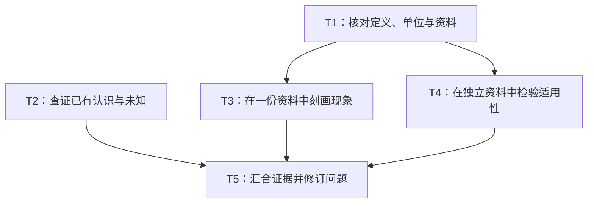

# 科研子问题、依赖与任务交接

需要拆解或分工时，按本参考设计任务包，并读取 [Brief](../assets/good-question-brief.md) 的问题结构、任务卡与结果返回部分作为交付格式。

## 1. 按所需认识拆分

围绕“回答上层问题需要先知道什么”形成子问题。尚无主问题时使用暂定的探索分支，只拆帮助理解或选择的工作；已选定问题则沿用其范围与目标。

每个子问题记录标识（如 `Q1`）、上层问题、已知依据与主要未知、对上层判断的贡献及不同结果的影响。检查全部子问题回答后仍不能回答什么，不固定数量或默认扩成完整机制链。

子问题表达要获得的认识，检索、数据准备、分析和实验是取得证据的任务。一项子问题可需要多个任务，公共输入核查也可服务多个子问题；任务数量不等于执行者数量。

## 2. 用输入条件安排依赖

明确合并结果所需的共同约定：问题表述、对象与范围、概念和测量定义、独立单位、目标量、探索与验证资料的关系。不同设计的结果须说明能在什么层面比较。

分工不会增加证据独立性。生物信息学任务保留供体与细胞层级、同源数据重用、训练验证划分及数据泄漏等适用检查。

交付两种关系：

- **问题结构表**：子问题贡献于哪个上层问题，各任务服务哪个子问题。
- **Mermaid 依赖图与任务表**：任务标识、所需输入、启动条件与当前就绪情况。箭头表示输入依赖。

输入就绪且范围不冲突的任务可并行。缺少条件时只等待受影响部分；循环依赖拆成先减少不确定性的一步和后续修订轮次。

例如，下图假设可获得两份独立资料。`T2` 可独立检索，`T3`、`T4` 需先核实各自输入：

资料不可得时保留待满足条件，不虚构数据或把重复分析称作独立验证。发现输入不可用也是有效核查结果；结果未齐可做阶段性综合，缺失证据不能当作已验证。

## 3. 让任务卡能独立交接

具体字段使用 Brief 中的任务卡。必要背景需随包提供或链接至执行者可访问的材料，不能只引用此前聊天。标明输入版本或处理状态，待查假设不作为已知事实传递。

方法以回答子问题为目的，明确最小工作、允许范围和验收方式。验收不要求显著或预设方向；阴性、冲突和不确定结果都可有效交付，未发现效应不自动等于不存在效应。

实际分发时再按能力、资源和依赖安排执行者。需要写文件时沿用指定项目约定；协调者维护共享记录，各任务只写分配的独立产物。任务包设计本身不启动执行，已有执行授权继续沿用。

## 4. 接收结果并回答上层问题

执行者按 Brief 返回发现、依据、输入状态、完成范围、技术检查、科学解释与未决项。协调者核对是否回答任务、依据能否定位、共同定义和输入是否适用；技术检查与科学判断分别验收，不仅接受“已完成”的自述。

按子问题汇总已回答、部分回答和未知内容，说明还缺什么才能回答主问题。结果冲突时回查原始来源，比较对象、设计、测量、假设和不确定性，检查证据重用。无法解释时保留冲突并提出最小追加检查，不平均不兼容结论或按数量投票。

## 5. 随问题变化更新

问题或承重前提变化时，沿依赖关系区分仍适用、需重新解释、需补查和需重做的任务与结果，说明理由并保留未受影响的工作。旧问题的结果与审计不能仅通过重命名视为回答了新问题。

重大方向取舍由研究者决定，常规核实与已授权工作继续开展。实际项目委派、状态持久化和交接按需使用 `research-context`。
